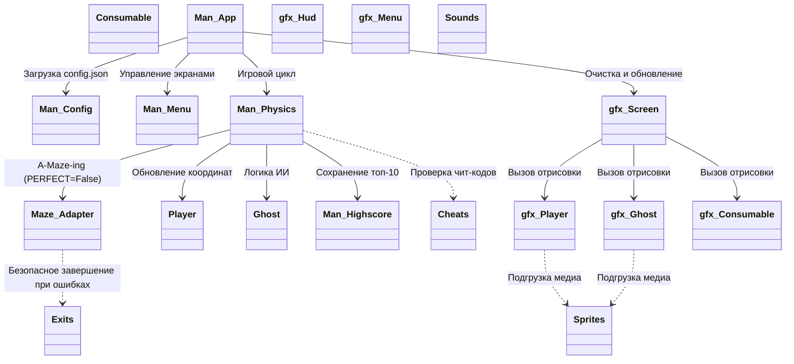

```mermaid
classDiagram
    class Player
    class Ghost
    class Consumable

    class Man_App
    class Man_Physics
    class Man_Menu
    class Man_Config
    class Man_Highscore

    class gfx_Screen
    class gfx_Player
    class gfx_Ghost
    class gfx_Consumable
    class gfx_Hud
    class gfx_Menu

    class Maze_Adapter
    class Cheats
    class Exits

    class Sprites
    class Sounds

    Man_App --> Man_Config : Загрузка config.json
    Man_App --> Man_Menu : Управление экранами
    Man_App --> Man_Physics : Игровой цикл
    
    Man_Physics --> Maze_Adapter : A-Maze-ing (PERFECT=False)
    Man_Physics --> Player : Обновление координат
    Man_Physics --> Ghost : Логика ИИ
    Man_Physics --> Man_Highscore : Сохранение топ-10
    Man_Physics ..> Cheats : Проверка чит-кодов
    
    Man_App --> gfx_Screen : Очистка и обновление
    gfx_Screen --> gfx_Player : Вызов отрисовки
    gfx_Screen --> gfx_Ghost : Вызов отрисовки
    gfx_Screen --> gfx_Consumable : Вызов отрисовки
    
    gfx_Player ..> Sprites : Подгрузка медиа
    gfx_Ghost ..> Sprites : Подгрузка медиа
    
    Maze_Adapter ..> Exits : Безопасное завершение при ошибках
```