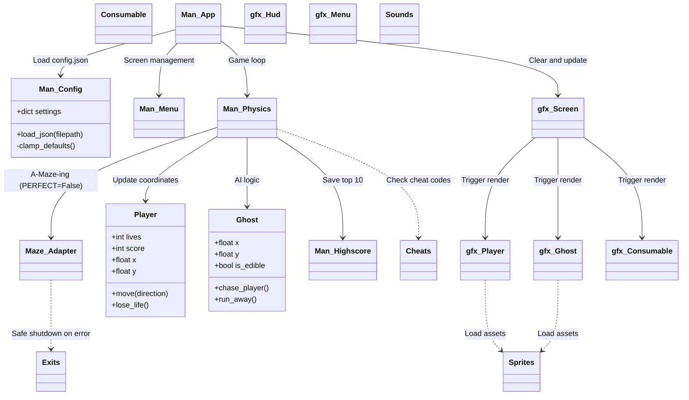

```mermaid
classDiagram
    class Player {
        +int lives
        +int score
        +float x
        +float y
        +move(direction)
        +lose_life()
    }
    class Ghost {
        +float x
        +float y
        +bool is_edible
        +chase_player()
        +run_away()
    }
    class Consumable

    class Man_App
    class Man_Physics
    class Man_Menu
    class Man_Config {
        +dict settings
        +load_json(filepath)
        -clamp_defaults()
    }
    class Man_Highscore

    class gfx_Screen
    class gfx_Player
    class gfx_Ghost
    class gfx_Consumable
    class gfx_Hud
    class gfx_Menu

    class Maze_Adapter
    class Cheats
    class Exits

    class Sprites
    class Sounds

    Man_App --> Man_Config : Load config.json
    Man_App --> Man_Menu : Screen management
    Man_App --> Man_Physics : Game loop

    Man_Physics --> Maze_Adapter : A-Maze-ing (PERFECT=False)
    Man_Physics --> Player : Update coordinates
    Man_Physics --> Ghost : AI logic
    Man_Physics --> Man_Highscore : Save top 10
    Man_Physics ..> Cheats : Check cheat codes

    Man_App --> gfx_Screen : Clear and update
    gfx_Screen --> gfx_Player : Trigger render
    gfx_Screen --> gfx_Ghost : Trigger render
    gfx_Screen --> gfx_Consumable : Trigger render

    gfx_Player ..> Sprites : Load assets
    gfx_Ghost ..> Sprites : Load assets

    Maze_Adapter ..> Exits : Safe shutdown on error
```