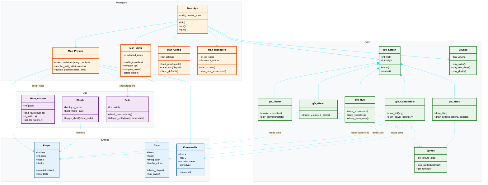

```mermaid
%%{init: {'theme': 'base', 'themeVariables': { 'clusterBkg': '#f8f9fa', 'clusterBorder': '#ced4da', 'lineColor': '#00E5FF'}}}%%
classDiagram
    namespace Entities {
        class Player {
            +int lives
            +int score
            +float x
            +float y
            +move(direction)
            +lose_life()
        }
        
        class Ghost {
            +float x
            +float y
            +string color
            +bool is_edible
            +chase_player()
            +run_away()
        }
        
        class Consumable {
            +float x
            +float y
            +int point_value
            +string type
            +consume()
        }
    }
    style Player fill:#E3F2FD,stroke:#1565C0,stroke-width:2px,color:#000000
    style Ghost fill:#E3F2FD,stroke:#1565C0,stroke-width:2px,color:#000000
    style Consumable fill:#E3F2FD,stroke:#1565C0,stroke-width:2px,color:#000000
    
    namespace Managers {
        class Man_App {
            +string current_state
            +init()
            +run()
            +quit()
        }
        
        class Man_Physics {
            +check_collisions(entity1, entity2)
            +resolve_wall_collision(entity)
            +update_positions(delta_time)
        }
        
        class Man_Menu {
            +int selected_index
            +handle_input(key)
            +navigate_up()
            +navigate_down()
            +select_option()
        }
        
        class Man_Config {
            +dict settings
            +load_json(filepath)
            +save_json(filepath)
            -clamp_defaults()
        }
        
        class Man_Highscore {
            +int top_score
            +list recent_scores
            +load_scores()
            +save_new_score(score)
        }
    }
    style Man_App fill:#FFF3E0,stroke:#E65100,stroke-width:2px,color:#000000
    style Man_Physics fill:#FFF3E0,stroke:#E65100,stroke-width:2px,color:#000000
    style Man_Menu fill:#FFF3E0,stroke:#E65100,stroke-width:2px,color:#000000
    style Man_Config fill:#FFF3E0,stroke:#E65100,stroke-width:2px,color:#000000
    style Man_Highscore fill:#FFF3E0,stroke:#E65100,stroke-width:2px,color:#000000

    namespace GFX {
        class gfx_Screen {
            +int width
            +int height
            +clear()
            +render()
        }
        
        class gfx_Player {
            +draw(x, y, direction)
            +play_animation(state)
        }
        
        class gfx_Ghost {
            +draw(x, y, color, is_edible)
        }
        
        class gfx_Consumable {
            +draw_dot(x, y)
            +draw_power_pellet(x, y)
        }
        
        class gfx_Hud {
            +draw_score(score)
            +draw_lives(lives)
            +show_game_over()
        }
        
        class gfx_Menu {
            +draw_title()
            +draw_buttons(options, selected)
        }
        
        class Sprites {
            +dict texture_atlas
            +load_spritesheet(path)
            +get_sprite(id)
        }
        
        class Sounds {
            +float volume
            +play_waka()
            +play_eat_ghost()
            +play_death()
        }
    }
    style gfx_Screen fill:#E8F5E9,stroke:#2E7D32,stroke-width:2px,color:#000000
    style gfx_Player fill:#E8F5E9,stroke:#2E7D32,stroke-width:2px,color:#000000
    style gfx_Ghost fill:#E8F5E9,stroke:#2E7D32,stroke-width:2px,color:#000000
    style gfx_Consumable fill:#E8F5E9,stroke:#2E7D32,stroke-width:2px,color:#000000
    style gfx_Hud fill:#E8F5E9,stroke:#2E7D32,stroke-width:2px,color:#000000
    style gfx_Menu fill:#E8F5E9,stroke:#2E7D32,stroke-width:2px,color:#000000
    style Sprites fill:#E8F5E9,stroke:#2E7D32,stroke-width:2px,color:#000000
    style Sounds fill:#E8F5E9,stroke:#2E7D32,stroke-width:2px,color:#000000

    namespace Utils {
        class Maze_Adapter {
            +int[][] grid
            +load_level(level_id)
            +is_wall(x, y)
            +get_tile_type(x, y)
        }
        
        class Cheats {
            +bool god_mode
            +bool infinite_lives
            +toggle_cheat(cheat_code)
        }
        
        class Exits {
            +list portals
            +check_teleport(entity)
            +teleport_entity(entity, destination)
        }
    }
    style Maze_Adapter fill:#F3E5F5,stroke:#6A1B9A,stroke-width:2px,color:#000000
    style Cheats fill:#F3E5F5,stroke:#6A1B9A,stroke-width:2px,color:#000000
    style Exits fill:#F3E5F5,stroke:#6A1B9A,stroke-width:2px,color:#000000
    
    %% --- ВЗАИМОДЕЙСТВИЯ (СВЯЗИ) ---

    %% Главный контроллер управляет менеджерами и экраном
    Man_App --> Man_Physics
    Man_App --> Man_Menu
    Man_App --> Man_Config
    Man_App --> Man_Highscore
    Man_App --> gfx_Screen
    Man_App --> Sounds

    %% Физика обновляет сущности и проверяет карту
    Man_Physics --> Player
    Man_Physics --> Ghost
    Man_Physics --> Consumable
    Man_Physics ..> Maze_Adapter : check walls
    Man_Physics ..> Exits : check teleports

    %% Композиция экрана из отдельных элементов отрисовки
    gfx_Screen *-- gfx_Player
    gfx_Screen *-- gfx_Ghost
    gfx_Screen *-- gfx_Consumable
    gfx_Screen *-- gfx_Hud
    gfx_Screen *-- gfx_Menu

    %% Элементы отрисовки читают состояния сущностей
    gfx_Player ..> Player : reads state
    gfx_Ghost ..> Ghost : reads state
    gfx_Consumable ..> Consumable : reads state
    gfx_Hud ..> Player : reads score/lives

    %% Элементы отрисовки используют ресурсы (спрайты)
    gfx_Player ..> Sprites
    gfx_Ghost ..> Sprites
    gfx_Consumable ..> Sprites
    gfx_Hud ..> Sprites
    gfx_Menu ..> Sprites

    %% Читы влияют на игрока
    Cheats ..> Player : modifies
```