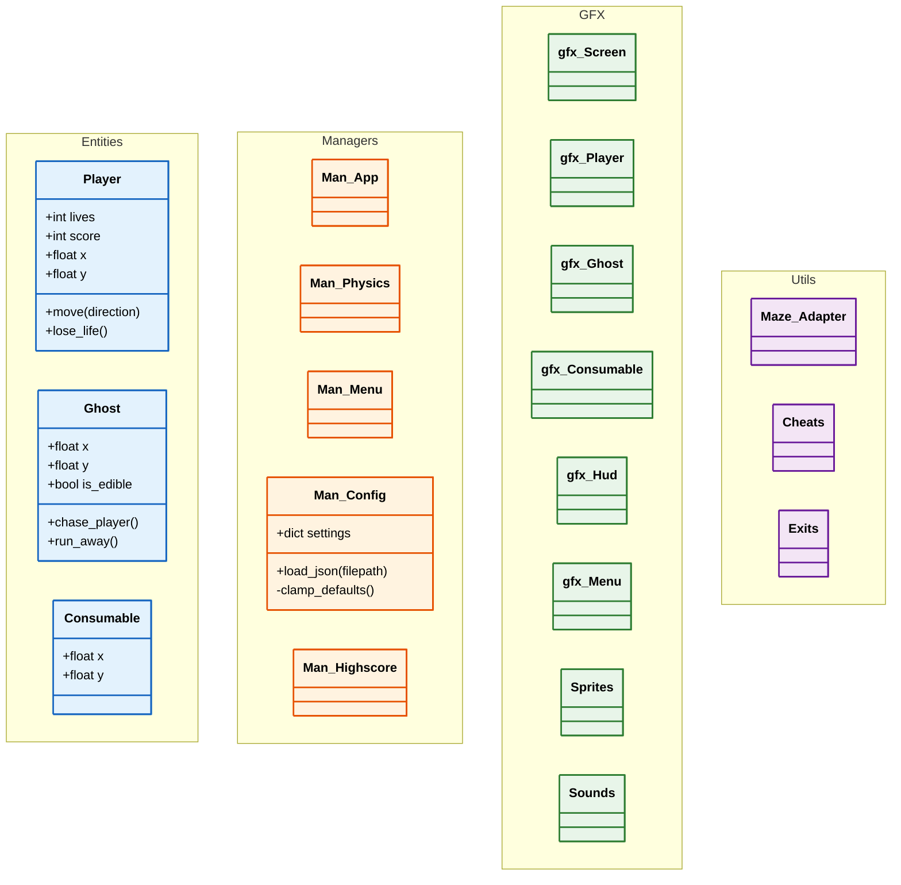

```mermaid
classDiagram
    namespace Entities {
        class Player {
            +int lives
            +int score
            +float x
            +float y
            +move(direction)
            +lose_life()
        }
        
        class Ghost {
            +float x
            +float y
            +bool is_edible
            +chase_player()
            +run_away()
        }
        
        class Consumable {
            +float x
            +float y
        }
    }
    %% Светло-синий фон, темно-синяя рамка, черный текст
    style Player fill:#E3F2FD,stroke:#1565C0,stroke-width:2px,color:#000000
    style Ghost fill:#E3F2FD,stroke:#1565C0,stroke-width:2px,color:#000000
    style Consumable fill:#E3F2FD,stroke:#1565C0,stroke-width:2px,color:#000000
    
    namespace Managers {
        class Man_App{
        }
        
        class Man_Physics {
        }
        
        class Man_Menu {
        }
        
        class Man_Config {
            +dict settings
            +load_json(filepath)
            -clamp_defaults()
        }
        
        class Man_Highscore
    }
    %% Светло-оранжевый фон, темно-оранжевая рамка, черный текст
    style Man_App fill:#FFF3E0,stroke:#E65100,stroke-width:2px,color:#000000
    style Man_Physics fill:#FFF3E0,stroke:#E65100,stroke-width:2px,color:#000000
    style Man_Menu fill:#FFF3E0,stroke:#E65100,stroke-width:2px,color:#000000
    style Man_Config fill:#FFF3E0,stroke:#E65100,stroke-width:2px,color:#000000
    style Man_Highscore fill:#FFF3E0,stroke:#E65100,stroke-width:2px,color:#000000

    namespace GFX {
        class gfx_Screen
        class gfx_Player
        class gfx_Ghost
        class gfx_Consumable
        class gfx_Hud
        class gfx_Menu
        class Sprites
        class Sounds
    }
    %% Светло-зеленый фон, темно-зеленая рамка, черный текст
    style gfx_Screen fill:#E8F5E9,stroke:#2E7D32,stroke-width:2px,color:#000000
    style gfx_Player fill:#E8F5E9,stroke:#2E7D32,stroke-width:2px,color:#000000
    style gfx_Ghost fill:#E8F5E9,stroke:#2E7D32,stroke-width:2px,color:#000000
    style gfx_Consumable fill:#E8F5E9,stroke:#2E7D32,stroke-width:2px,color:#000000
    style gfx_Hud fill:#E8F5E9,stroke:#2E7D32,stroke-width:2px,color:#000000
    style gfx_Menu fill:#E8F5E9,stroke:#2E7D32,stroke-width:2px,color:#000000
    style Sprites fill:#E8F5E9,stroke:#2E7D32,stroke-width:2px,color:#000000
    style Sounds fill:#E8F5E9,stroke:#2E7D32,stroke-width:2px,color:#000000

    namespace Utils {
        class Maze_Adapter
        class Cheats
        class Exits
    }
    %% Светло-фиолетовый фон, темно-фиолетовая рамка, черный текст
    style Maze_Adapter fill:#F3E5F5,stroke:#6A1B9A,stroke-width:2px,color:#000000
    style Cheats fill:#F3E5F5,stroke:#6A1B9A,stroke-width:2px,color:#000000
    style Exits fill:#F3E5F5,stroke:#6A1B9A,stroke-width:2px,color:#000000
```